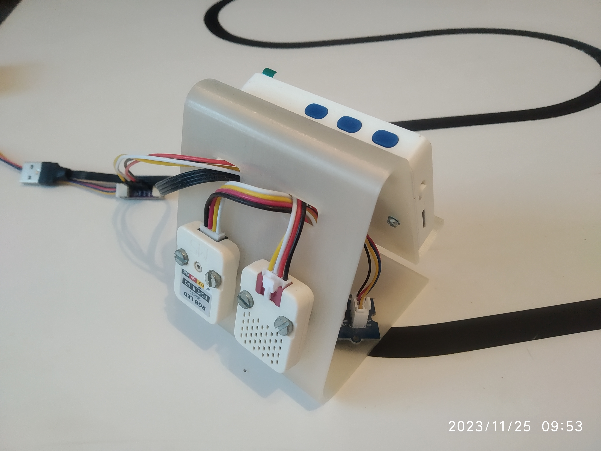
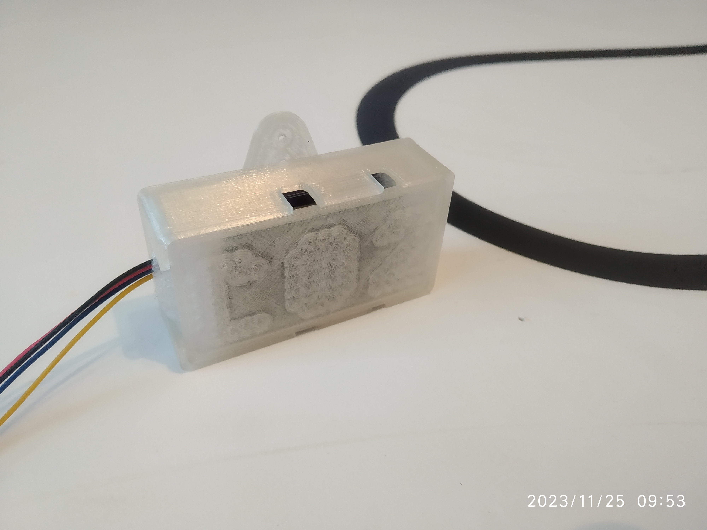

# iot-weather-and-co2-terminal

IoT weather and CO2 terminal is a device based on the Wio Terminal to measure and display indoor CO2 concentration, temperature and humidity as well as display outdoor conditions (temperature, humidity, atmospheric pressure) by receiving this info using MQTT. The device also shows current time that it also receives via MQTT.

features:
* 3D printed stand
* Wio Terminal
* Sensirion SCD30 CO2 sensor with a 3D printed case
* M5Stack RGB LED Unit (SK6812)
* M5Stack ENV III Unit

For displaying info from outside weather station using MQTT, a Wi-Fi connection is required. Wi-Fi credentials and MQTT server/topics are configured by loading files from microSD card that is inserted to the Wio Terminal.

The files that need to be present on the microSD card and their contents are:
* _wifi_ssid.txt_ - SSID of our Wi-Fi network
* _wifi_pass.txt_ - password to connect to our Wi-Fi network
* _serveraddr.txt_ - IP/hostname of MQTT server used to communicate
* _mqtt_port.txt_ - MQTT server port
* _topic_temperature.txt_ - MQTT topic the device will subscribe to in order to get outside temperature info
* _topic_humidity.txt_ - MQTT topic the device will subscribe to in order to get outside humidity info
* _topic_pressure.txt_ - MQTT topic the device will subscribe to in order to get atmospheric pressure info
* _topic_time.txt_ - MQTT topic the device will subscribe to in order to get current time (as a string)

